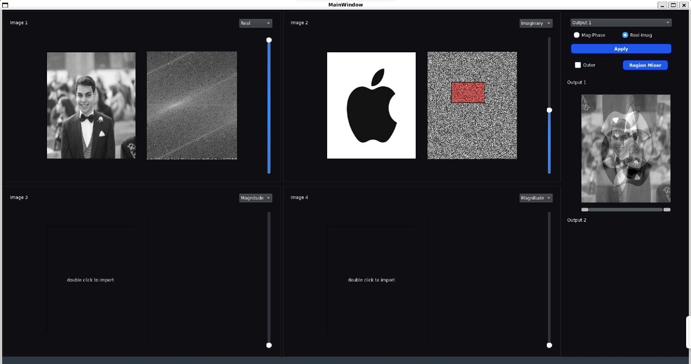
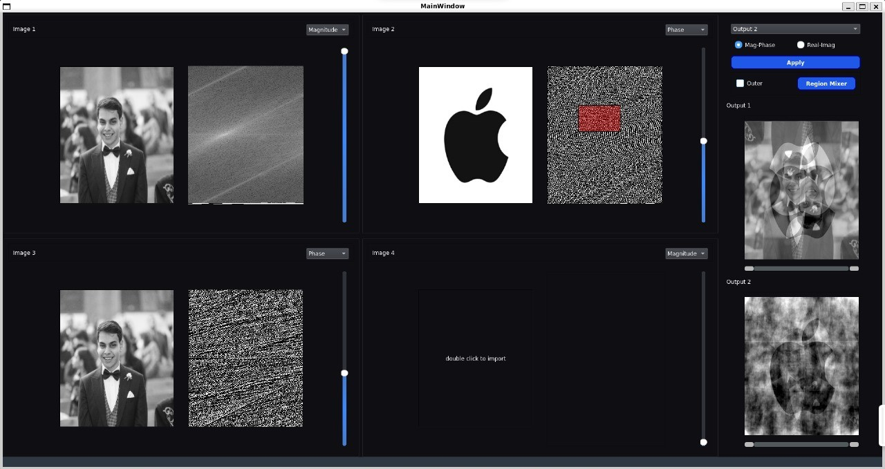

# FT Magnitude/Phase Mixer or Emphasizer

## Overview

The **FT Magnitude/Phase Mixer or Emphasizer** is a desktop application designed to demonstrate the significance of magnitude and phase components in signals. By manipulating and visualizing these Fourier Transform (FT) components, the software emphasizes their respective contributions to a signal. Though the focus is on 2D signals (images) for clarity, the concept is universally applicable to any signal type.

This application is equipped with an intuitive user interface for interactive experimentation and real-time feedback.

---

## Features

### Image Viewers
- **Multi-Image Support**: Open and view up to four grayscale images simultaneously, each displayed in its own viewport.
  - **Automatic Grayscale Conversion**: Colored images are converted to grayscale upon loading.
  - **Unified Sizing**: All images are resized to match the smallest image dimensions for consistency.
- **Four FT Component Displays**:
  - FT Magnitude
  - FT Phase
  - FT Real
  - FT Imaginary
  - Users can switch components via a combo-box/drop-down menu.
- **Easy Image Browsing**: Double-click any viewport to replace the image with a new one.

### Output Ports
- **Dual Output Viewports**: Results from mixing operations can be displayed in either of the two dedicated output viewports.
- **Viewport Features**: Output viewports offer the same functionality as input viewports for displaying FT components and adjusting settings.

### Brightness/Contrast Adjustment
- **Interactive Controls**: Adjust brightness and contrast of any image or its FT components using mouse dragging:
  - Vertical drag: Brightness
  - Horizontal drag: Contrast

  

---

## Components Mixer
- **Customizable Weights**: Users can set weights for each image’s FT components (e.g., magnitude and phase or real and imaginary) using sliders.
- **Real-Time Mixing**: The output image is generated via an inverse Fourier Transform (iFFT) of the weighted averages of the input image FTs.
- Adjustable weights for fine-tuning component contributions.

  
---

## Regions Mixer
- **Frequency Region Selection**:
  - Define inner (low frequencies) or outer (high frequencies) regions of the FT components by drawing a rectangle.
  - Highlight the selected region with semi-transparent coloring or hashing.
- **Customizable Region Size**: Adjust the rectangle size/percentage via sliders or resize handles.
- **Unified Region Selection**: The region applies uniformly across all images for consistency.

---

## Realtime Mixing
- **Progress Bar**: Displayed during mixing operations to indicate progress.
- **Thread Management**: Ensures responsiveness by canceling ongoing operations when new mixing settings are applied.

---

## How to Use
1. **Load Images**:
   - Open up to four images into the input viewports.
   - Ensure all images are converted to grayscale automatically.
2. **Adjust View**:
   - Use the combo-box/drop-down to explore different FT components for each image.
   - Adjust brightness/contrast as needed.
3. **Customize Mixing**:
   - Set weights for FT components using sliders.
   - Select inner or outer regions with the rectangle tool and resize it for precision.
4. **Generate Output**:
   - View the mixed results in one of the output viewports.
   - Monitor progress through the progress bar for lengthy operations.
5. **Interact and Iterate**:
   - Make changes in real-time and see immediate updates without restarting the program.

---

## Technical Details
- **Programming Language**: Python 
- **Libraries Used**: Libraries such as OpenCV, NumPy, and PyQt/PySide (for GUI) efficient image processing and user interface.
- **Concurrency**: Threading mechanisms ensure smooth operation and real-time interactivity.

